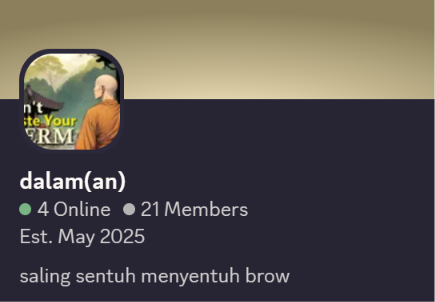

<p align="center">
  
</p>

<h1 align="center">dalam-ring</h1>

<p align="center">
  <em>a decentralized webring for dalam(an) — based on <a href="https://github.com/spuuntries/da-ring"><code>da-ring</code></a></em><br/>
  <sub>degenerate ahh group of ppl</sub>
</p>

<p align="center">
  
  
  
</p>

---

## why

traditional webrings have a central server that manages the member list. if that server goes down or the maintainer walks away, the ring dies. and someone has to babysit it.

da-ring flips this — every member's website _is_ a node. the member list is a CRDT that converges through normal HTTP fetches. no server to maintain, no single point of failure, no one person who has to keep things running.

the invite tree means governance is baked into the data structure itself. no need for voting systems or admin panels — if you invited someone and they turn out to be a problem, you revoke them and their entire subtree goes with them. simple, deterministic, no drama infrastructure.

it's designed for friend groups who want a webring without anyone having to be "the webring person."

## how it works

each ring member's site hosts a `webring.json` file — a set of signed operations (adds, revokes, leaves). the webring widget fetches from multiple members and merges everything client-side. no central server — your website _is_ your node.

membership is governed by an **invite tree**: every member has an inviter, the tree is the authority structure.

### ✦ two tiers

|                 | passive                | active                   |
| --------------- | ---------------------- | ------------------------ |
| **setup**       | paste a `<script>` tag | also host `webring.json` |
| **can invite?** | no                     | yes                      |
| **redundancy**  | reads from actives     | serves state to others   |

most friends just need to be passive. the genesis member (you) is always active.

## quick start

> [!note]
> Since this is alrd a set up ring, it's either that you've been invited, or you want to upgrade to an active member to invite others.

### 1. you've been invited

Your friend's gonna give you a widget snippet like this:

```html
<script
  src="https://friend.site/dalaman-widget.html"
  data-ring="https://friend.site"
  data-ring-name="dalam(an)"
></script>
```

replace `friend.site` with your friend's domain.

### 2. you wanna invite people

If you wanna invite new people to the ring, you gotta upgrade first into an active member. This way, you also host an instance of the ring on your site and people can query to you for the ring's state.

```bash
# clone this repo
git clone https://github.com/spuuntries/dalam-ring
cd da-ring && npm install

# upgrade — pulls state from an active member, generates your keypair
npx da-ring upgrade --ring https://your.site --url https://inviter.site
```

where `your.site` is your domain and `inviter.site` should be your inviter, but any active member which is aware of your existence on the ring (i.e., that they would see you when they run `npx da-ring status`) would work here.

Then, say you're inviting `other friend`,

```bash
npx da-ring invite https://other-friend.site --name "other friend"
```

re-deploy your updated `dalaman.json`, then tell your friend to paste the widget:

```html
<script
  src="https://your.site/dalaman-widget.html"
  data-ring="https://inviter.site,https://your.site"
  data-ring-name="frens webring"
></script>
```

then, host the built `dist/index.widget.html` on your site or a CDN. here it's been renamed as `dalaman-widget.html` for simplicity, but you can rename the file into whatever, just change it in the `src` field when you're embedding the widget.

## hosting & cors & polyglot

because the webring works by having browsers fetch `<ring-name>.json` from other members' domains, **your web server MUST be configured to send CORS headers** (`Access-Control-Allow-Origin: *`) for the json file.

additionally, if you want your widget script link to generate a **Discord rich embed**, you must use the `widget.html` polyglot. however, browsers will refuse to execute `.html` files as scripts if your server sends the `X-Content-Type-Options: nosniff` header.

you have two options for embedding the widget:

- **Option A (Discord Rich Embed)**: host the file as `widget.html`.
  - **github pages**: usually enables CORS by default and _does not_ send `nosniff`, so this works out of the box!
  - **vercel / netlify**: these hosts send `nosniff` by default. you must add a `vercel.json` or `netlify.toml` file to explicitly add CORS headers and remove `nosniff`.
- **Option B (Standard Script, no Discord embed)**: rename the built file to `widget.js` and use `<script src=".../widget.js">`. this works everywhere without worrying about `nosniff`, but you lose the Discord embed preview.

- **domain redirects**: if your host automatically redirects your naked domain to `www` (or vice versa), the 308 redirect response often drops custom CORS headers, breaking the fetch. to fix this, ensure the URLs in your `data-ring` script tag point directly to your primary non-redirecting domain.

example `vercel.json` for vercel users (replace `dalaman-widget.html` with the filename if you've renamed it):

```json
{
  "headers": [
    {
      "source": "/dalaman.json",
      "headers": [
        { "key": "Access-Control-Allow-Origin", "value": "*" },
        { "key": "Access-Control-Allow-Methods", "value": "GET, OPTIONS" }
      ]
    },
    {
      "source": "/dalaman-widget.html",
      "headers": [{ "key": "X-Content-Type-Options", "value": "" }]
    }
  ]
}
```

### meta tags & link previews

the HTML polyglot embeds standard Open Graph (`og:image`) and Twitter Card meta tags to display a nice preview image when you link your widget on social media platforms like Discord, Twitter, and Slack.

because social media scrapers do not support base64-encoded images, the widget's meta tags reference a file named `dontwaste.jpg` on root. if you want image previews to work, you must host said banner image. if you don't care about the preview image, you can simply ignore this, the thing will work just fine.

## cli

all commands: `npx da-ring <command>`

| command                                  | description                                                |
| :--------------------------------------- | :--------------------------------------------------------- |
| **`init`** `--url <url>`                 | initialize a new ring                                      |
| **`invite`** `<url> --name <name>`       | invite someone                                             |
| **`revoke`** `<url> [--soft]`            | revoke a member (cascades by default, `--soft` re-parents) |
| **`leave`**                              | leave the ring _(your invitees get re-parented)_           |
| **`upgrade`** `--ring <url> --url <url>` | passive → active                                           |
| **`sync`**                               | pull state from active peers                               |
| **`status`**                             | show ring info and invite tree                             |

## the crdt

> **Note**: For a detailed technical breakdown of the CRDT, conflict resolution, and security model, see the [da-ring Specification](spec.md).

the ring state is a **grow-only set of signed operations** (G-Set).

```
merge(a, b) = a ∪ b    // set union — commutative, associative, idempotent
```

each operation is signed with Ed25519 and includes causal dependencies (`seen` op IDs). everyone with the same ops derives the same member list by replaying in causal order.

### operations

| op            | what it does                             | signed by |
| :------------ | :--------------------------------------- | :-------- |
| **genesis**   | creates the ring, sets name + budget     | founder   |
| **add**       | invites a new member                     | inviter   |
| **key-claim** | publishes pubkey (passive → active)      | self      |
| **revoke**    | removes invitee (cascades or re-parents) | inviter   |
| **leave**     | exits, children re-parented to inviter   | self      |

### conflict resolution

- deterministic resolution of concurrent ops via causal order + ID tie-break
- invite budget enforced at derivation time
- only direct inviters can revoke their invitees
- deterministic ring order via `SHA-256(member URL)`

## governance

the invite tree _is_ the governance:

```
alice (genesis)
├── bob
│   └── carol ← bob can revoke
└── dave     ← alice can revoke
```

- **revoke** cascades: revoking bob also removes carol (unless you use `--soft`, which re-parents carol to alice)
- **leave** re-parents: if bob leaves, carol moves under alice
- no voting, no quorum — the tree is the authority

### key recovery & soft revokes

if a member loses their private key (`.da-ring/keys.json`), they can no longer sign new operations.

to recover, their inviter must use `npx da-ring revoke <url> --soft`. this removes the lost-key member from the ring, but **re-parents all of their invitees** to the inviter (saving innocent members from being nuked).

after the soft-revoke, the inviter can re-invite them using the exact same URL. because da-ring enforces causal signature verification, the member can publish a brand new key for their URL without breaking the past, and attackers cannot use their stolen old key to forge new invites!

## customizing

edit the styles in [`src/widget/render.ts`](src/widget/render.ts) and rebuild. the widget uses shadow DOM so nothing leaks.

```bash
npm run build
```

## architecture

```
src/
├── crdt/           # CRDT engine (isomorphic)
│   ├── ops.ts      # operation types + signing
│   ├── state.ts    # G-Set merge + view derivation
│   └── validate.ts # signature + rule validation
├── crypto/
│   └── keys.ts     # Ed25519 + SHA-256
├── cli/            # CLI commands
│   ├── config.ts   # local state management
│   └── commands/   # init, invite, revoke, leave, upgrade, sync, status
└── widget/         # browser widget (23KB bundle)
    ├── index.ts    # fetch + merge + orchestrate
    └── render.ts   # shadow DOM rendering + styles
```

## license

MIT
